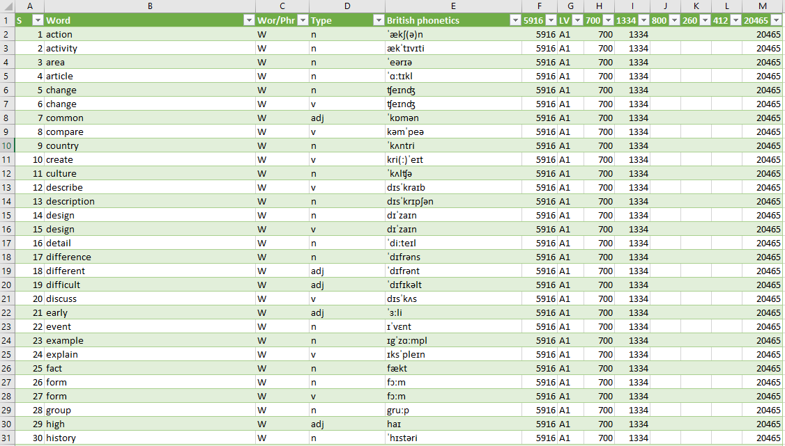

# English_Language_Database_2020-Murilo_Krominski
This new Repository has: 

</a>

## Database 2020 (academic use):

###  DATABASE with the most important words/phrases to improve your English
Almost <b>20 thousand</b> exclusive words / phrases, ordered in order of importance to improve a fluent English vocabulary.
 Developed by Murilo Krominski as a date for another Open Source Project, released for anyone to use or improve. 

<b>CSV columns:</b> 
Sequential numbers 
World 
World/Phrase 
Type 
British phonetics</b> 
5916 most important words to learn in English, from A1 to C1 level 
Level 
700 most important academic words (spoken single words) 
1334 most important academic words (written single words) 
800 most common expressions/phrases from levels A1 to C1 
260 most common academic phrases (spoken phrases) 
412 most important academic phrases (written phrases) 
20465 unique keywords (from 84939 websites) 
<a href="https://github.com/MuriloKrominski/English_Language_Database_2020-Murilo_Krominski/blob/master/DATA-KROMINSKI.csv">DATA-KROMINSKI.csv</a>

## Database 2020 (Fragmented):

###  5916 most important words to learn in English
List of the 5916 most important words to learn in English, from A1 to C1 level. 
<a href="https://github.com/MuriloKrominski/English_Language_Database_2020-Murilo_Krominski/blob/master/csv/5916%20most%20important%20words%20to%20learn%20in%20English.csv">5916 most important words to learn in English.csv</a>

###  20465 unique keywords (from 84939 websites)
Alexa (from Amazon) extracted data from the top <b>1,000,000 sites worldwide</b>, and from these, only those found in Australia, Canada, Ireland, New Zealand, United Kingdom and United States were selected. 
<b>A huge database!</b> About <b>12 billion words</b> on <b>18 million web pages</b> from <b>84 thousand sites</b>. 
<a href="https://github.com/MuriloKrominski/English_Language_Database_2020-Murilo_Krominski/blob/master/csv/20465 keywords.csv">20465 keywords.csv</a> 
<a href="https://github.com/MuriloKrominski/English_Language_Database_2020-Murilo_Krominski/blob/master/csv/84939 websites.csv">84939 websites.csv</a>

###  800 most common phrases
List of 800 most common expressions/phrases from levels A1 to C1. Includes idioms, phrasal verbs, compounds, placements, prepositional phrases and other common fixed phrases. 
<a href="https://github.com/MuriloKrominski/English_Language_Database_2020-Murilo_Krominski/blob/master/csv/800%20most%20common%20phrases.csv">800 most common phrases.csv</a>

###  260 most common academic phrases (spoken phrases)
A list that provide the most important words and phrases to know for academic speaking. This list gives around 260 of the most important phrases. 
<a href="https://github.com/MuriloKrominski/English_Language_Database_2020-Murilo_Krominski/blob/master/csv/260%20most%20common%20academic%20phrases.csv">260 most common academic phrases.csv</a>

###  700 most important academic words (spoken single words)
This list presents the 700 most important words in academic speech, divided into six sublists, with the most important words in Sublist 1. 
<a href="https://github.com/MuriloKrominski/English_Language_Database_2020-Murilo_Krominski/blob/master/csv/700%20most%20common%20spoken%20academic%20words.csv">700 most common academic words.csv</a>

###  1334 most important academic words (written single words)
This list gives the 1334 most important words in academic writing, divided into twelve sublists, with the most important words in Sublist 1. 
<a href="https://github.com/MuriloKrominski/English_Language_Database_2020-Murilo_Krominski/blob/master/csv/1334%20most%20important%20academic%20words.csv">1334 most important academic words.csv</a>

###  412 most important academic phrases (written phrases)
This list gives 412 important phrases for academic writing, from 15 functional areas. 
<a href="https://github.com/MuriloKrominski/English_Language_Database_2020-Murilo_Krominski/blob/master/csv/412%20most%20important%20academic%20phrases.csv">412 most important academic phrases.csv</a>
